# Welcome to senstate 👋

[![Build Status][build-img]][build-url]
[![Code Coverage][cov-img]][cov-url]
[![NPM Version][npm-img]][npm-url]
[![Package Size][size-img]][size-url]
[![LGTM Grade][lgtm-img]][lgtm-url]
[![Known Vulnerabilities][snyk-img]][snyk-url]

[build-img]: https://github.com/senstate/platform/workflows/Pull-Request%20CI/badge.svg
[build-url]: https://github.com/senstate/platform/actions?query=workflow%3A%22Pull-Request+CI%22
[cov-img]: https://codecov.io/gh/senstate/platform/branch/master/graph/badge.svg
[cov-url]: https://codecov.io/gh/senstate/platform
[npm-img]: https://img.shields.io/npm/v/@senstate/cli.svg?
[npm-url]: https://www.npmjs.com/package/@senstate/cli
[size-img]: https://img.shields.io/bundlephobia/minzip/@senstate/cli.svg
[size-url]: https://bundlephobia.com/result?p=@senstate/cli
[lgtm-img]: https://img.shields.io/lgtm/grade/javascript/g/senstate/platform.svg
[lgtm-url]: https://lgtm.com/projects/g/senstate/platform
[snyk-img]: https://snyk.io/test/npm/@senstate/cli/badge.svg
[snyk-url]: https://snyk.io/test/npm/@senstate/cli

> Send your state / variables to the Debug Dashboard while developing :tada:


> Current workflow:



> Upcoming:


## Articles / Tutorial

>[Introduction](https://dev.to/negue/senstate-make-sense-of-your-state-while-debugging-96f)

## Install Dashboard

```sh
npm install @senstate/cli
```

## Usage

```sh
senstate
```

or

```sh
npx @senstate/cli
```

## Client-Libraries

| Language | Link              | Author                  |
| -------- | ----------------- | ----------------------- |
| JS/TS    | [Repo][repo_js]   | [negue][user_negue]     |
| C#       | *(in progress)*   | [negue][user_negue]     |
| Rust     | [Repo][repo_rust] | [dnaka91][user_dnaka91] |
| Kotlin   | *(in progress)*   | [dnaka91][user_dnaka91] |
| Go       | [Repo][repo_go]   | [dnaka91][user_dnaka91] |

[repo_js]: /libs/client/README.md
[repo_rust]: https://github.com/dnaka91/senstate-rs
[repo_go]: https://github.com/dnaka91/senstate-go

[user_negue]: https://github.com/negue
[user_dnaka91]: https://dnaka91.netlify.com

All clients connect with web-sockets, here are the current [specs](api.spec.md).

## TODO / In progress

- C# Client
- more to come :)

## Show your support

Give a ⭐️ if this project helped you!

If you have features / ideas, open an issue :)

***

_This README was generated with ❤️ by [readme-md-generator]._

[readme-md-generator]: https://github.com/kefranabg/readme-md-generator
